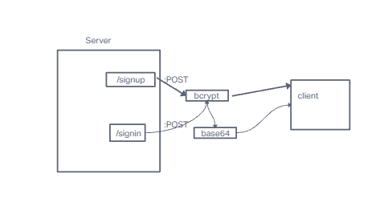

# LAB - Class 06

## Project: basic-auth

### Author: Emmanuel Gonzales

### Problem Domain  

This lab is to Practice making express servers in basic authentication capabilities.

### Links and Resources

- [GitHub Actions ci/cd](https://github.com/Emmanuel-Gonzales/basic-auth/actions)
- [back-end server url](http://xyz.com) (when applicable)
- [front-end application](http://xyz.com) (when applicable)

### Collaborators

### Setup

#### `.env` requirements (where applicable)

- `PORT` - 3001

#### How to initialize/run your application (where applicable)

- create repo on GitHub
- clone repo to local machine
- `npm init -y`
- `npm i base-64 bcrypt cors dotenv express jest pg sequelize sequelize-cli sqlite3`
- `nodemon` or `node index.js` to start server

#### How to use your library (where applicable)

#### Features / Routes

- Feature One: Details of feature
- GET : `/` - specific route to hit
- POST: `/signup` - to create a 'user' in the database
- POST: `/signin` - to view a created user

#### UML

